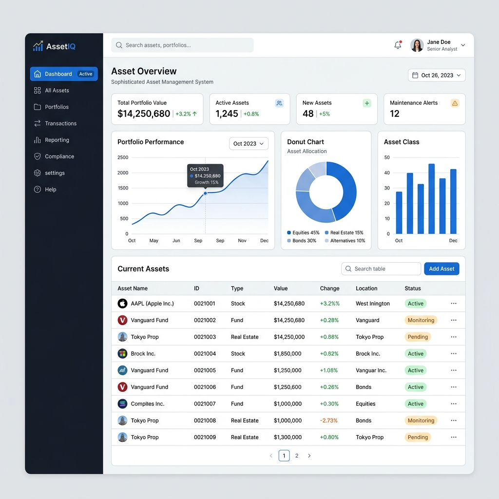
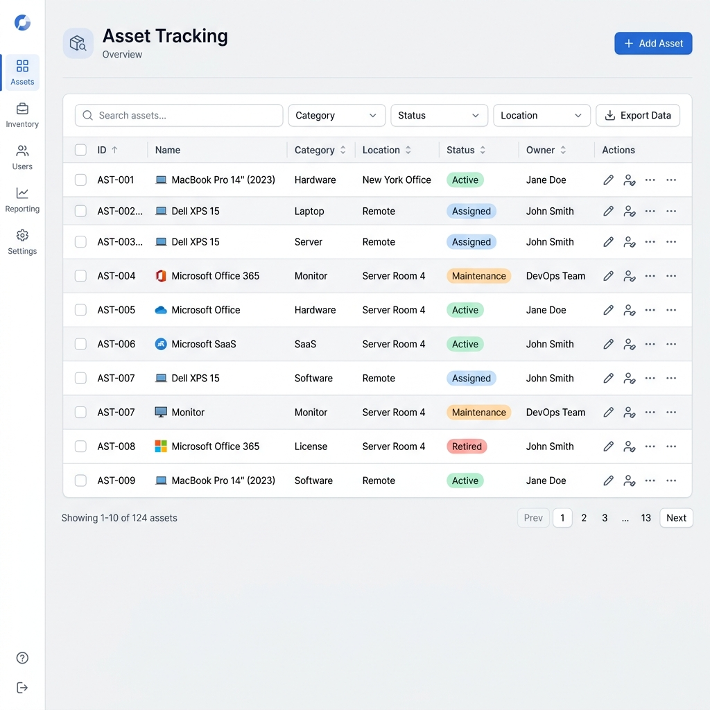

# AssetFlow: Enterprise Asset Management System

[](https://opensource.org/licenses/MIT)

AssetFlow is a comprehensive Asset Management System designed to track, manage, and optimize your organization's assets seamlessly. Built with a robust Python/FastAPI backend and a highly responsive React/Vite frontend, AssetFlow provides real-time insights into your inventory, maintenance schedules, and asset lifecycle.

---

## 📸 Screenshots

### Dashboard Overview
*The main dashboard provides a high-level view of all active assets, maintenance tasks, and recent activities.*


### Asset Registry
*The Asset Tracking page allows administrators to add, view, update, and remove assets efficiently with a powerful data grid.*


---

## ✨ Features

- **Dashboard Analytics:** Get an overview of all assets, maintenance statuses, and active locations at a glance.
- **Advanced Asset Tracking:** Detailed registry of all company assets, including hardware, software, and physical properties.
- **Maintenance Management:** Schedule, track, and log maintenance tasks for every asset to prevent unexpected downtime.
- **Role-Based Authentication:** Secure access control for administrators, managers, and standard users.
- **Modern Responsive UI:** A state-of-the-art web application built with React, Vite, and CSS for maximum flexibility.
- **High-Performance Backend:** A lightning-fast RESTful API powered by FastAPI, SQLAlchemy, and SQLite.
- **Robust Security:** JWT-based authentication and secure password hashing.

---

## 🛠️ Tech Stack

### Frontend
- **Framework:** React + Vite
- **Styling:** Custom CSS with modern UI patterns
- **Language:** JavaScript
- **Key Libraries:** React Router DOM, Axios

### Backend
- **Framework:** FastAPI (Python 3)
- **Database:** SQLite (Relational DB)
- **ORM:** SQLAlchemy
- **Migrations:** Alembic
- **Security:** passlib, python-jose (JWT)

---

## 🚀 Getting Started

Follow these instructions to get a copy of the project up and running on your local machine for development and testing purposes.

### Prerequisites

Ensure you have the following installed:
- [Node.js](https://nodejs.org/) (v16 or higher)
- [Python](https://www.python.org/) (v3.8 or higher)
- Git

---

### Running the Backend

1. **Navigate to the backend directory:**
   ```bash
   cd assetflow-backend
   ```

2. **Create and activate the virtual environment:**
   ```bash
   # Windows
   python -m venv venv
   .\venv\Scripts\activate
   
   # Linux/Mac
   python3 -m venv venv
   source venv/bin/activate
   ```

3. **Install backend dependencies:**
   ```bash
   pip install -r requirements.txt
   ```

4. **Set up the environment variables:**
   Copy `.env.example` to `.env` and configure as needed.
   
5. **Run database migrations & seed data:**
   ```bash
   alembic upgrade head
   python seed_data.py
   ```

6. **Start the API server:**
   ```bash
   python -m uvicorn app.main:app --reload
   ```
   *The API will be available at `http://localhost:8000`. You can access the automatic interactive API documentation at `http://localhost:8000/docs`.*

---

### Running the Frontend

1. **Navigate to the frontend directory:**
   ```bash
   cd assetflow-frontend
   ```

2. **Install frontend dependencies:**
   ```bash
   npm install
   ```

3. **Start the Vite development server:**
   ```bash
   npm run dev
   ```
   *The application will automatically open in your default browser, usually at `http://localhost:5173`.*

---

## 🤝 Contributing

Contributions, issues, and feature requests are welcome! 
Feel free to check the [issues page](https://github.com/jiya2000/Asset/issues) if you want to contribute.

## 📄 License

This project is licensed under the MIT License - see the LICENSE file for details.
